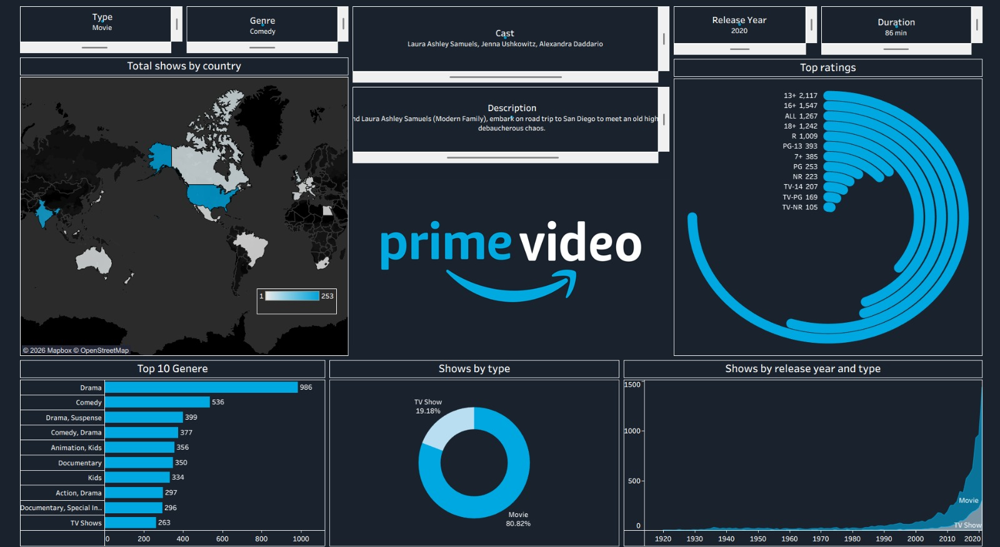

# Amazon Prime Video Tableau Dashboard

## Project Overview

This Tableau dashboard provides an interactive analysis of Amazon Prime Video movies and TV shows using engaging visualizations and filters. The project helps users explore content distribution, genre trends, ratings, release patterns, and comparisons between movies and TV shows.

---

## Dashboard Preview



---

## Key Insights

The dashboard enables users to analyze:

* Content distribution across countries
* Top-performing genres
* Ratings distribution and analysis
* Release year trends
* Comparison of Movies vs TV Shows
* Cast and show description details

---

## Dataset Used

### `amazon_prime_titles.csv`

The dataset contains detailed information about Amazon Prime Video content, including:

* Show Titles
* Genres
* Ratings
* Release Years
* Duration
* Countries
* Cast Information
* Show Type (Movie / TV Show)

---

## Tools & Technologies

* **Tableau Public / Tableau Desktop**
* **CSV Dataset**
* **GitHub**

---

## Dashboard Features

### Interactive Filters

Users can filter content by:

* Type
* Genre
* Cast
* Release Year
* Duration

### Visualizations Included

* Country-wise content distribution map
* Top genres bar chart
* Ratings analysis visualization
* Release year trend chart
* Movie vs TV Show comparison donut chart

---

## Project Structure

```bash
Amazon-Prime-Video-Tableau-Dashboard/
│
├── Amazon_Prime_Dashboard.twbx
├── amazon_prime_titles.csv
├── README.md
└── screenshots/
    └── dashboard.png
```

---

## How to Use

1. Download or clone this repository.
2. Open the `.twbx` file using Tableau Public or Tableau Desktop.
3. Explore the interactive dashboard and apply filters for deeper analysis.

---

## Future Improvements

Potential enhancements for this project:

* Add streaming trends over time
* Include actor popularity analysis
* Integrate live data updates
* Build recommendation-based insights

---

## Author

**SAAHINI PASHAM**

---

## Connect

Feel free to connect or contribute to improve this project.